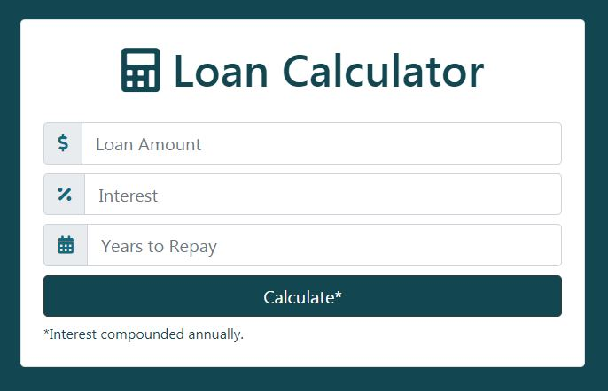
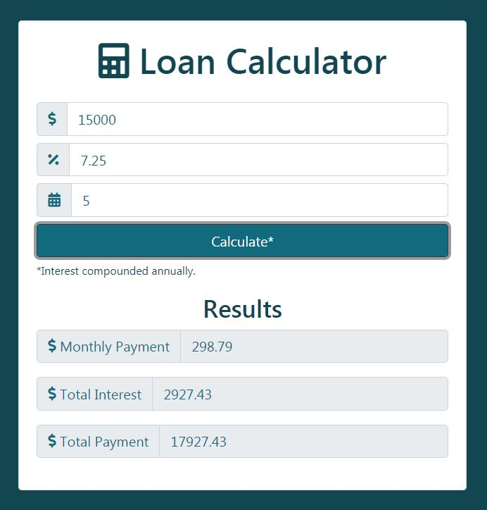

# loanCalculator

*loanCalculator* is an app created under the direction of [Brad Traversy](https://www.udemy.com/modern-javascript-from-the-beginning/) in his *Modern JavaScript from the Beginning* course. The app uses the following technologies:

  * JavaScript
  * HTML
  * CSS
  * Bootstrap 4

### Calculating…

On submit, *loanCalculator* uses a `.gif` to enhance the user experience before outputting the calculation results.

### Error Handling

The app incorporates error handling through JavaScript. 

### Results

The app calculates interest compounded annually, and outputs total interest, total payment, and monthly payment.

